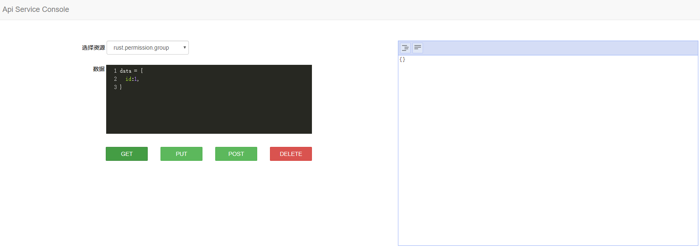

### 快速上手

1. 安装rust
>pip install -U git+https://github.com/limoxi/rust.git

2. 新建项目(当前目录下)
>rust-cli init my_project && cd my_project
此时可观察my_project中的文件和目录结构，如图：

>api =>REST API层，负责响应HTTP请求
>business =>业务层
>commands =>命令、脚本
>config =>配置文件
>db =>资源orm
>middlewares =>中间件
>manage.py =>功能同django的命令管理功能，具体命令存放于commands目录下
>settings.py =>项目配置

3. 配置数据库连接(当前只支持mysql)
>创建本地数据库
>CREATE DATABASE rust;
创建用户并赋予权限
>CREATE USER ruster@localhost IDENTIFIED BY 'test';
>GRANT ALL ON rust.* TO ruster@localhost;
>修改settings.py中DB_NAME，DB_USER，DB_PASSWORD，DB_HOST，DB_PORT为本地数据库相应的值
>同步数据库models
>python manage.py syncdb

4. 本地运行项目
>python manage.py runserver

5. 检查是否成功运行
> 打开浏览器，输入127.0.0.1:9000/console, 出现下图内容即成功

6. 新增第一个资源
>rust-cli add first_resource
>刷新127.0.0.1:9000/console，看看有什么变化

7. ...